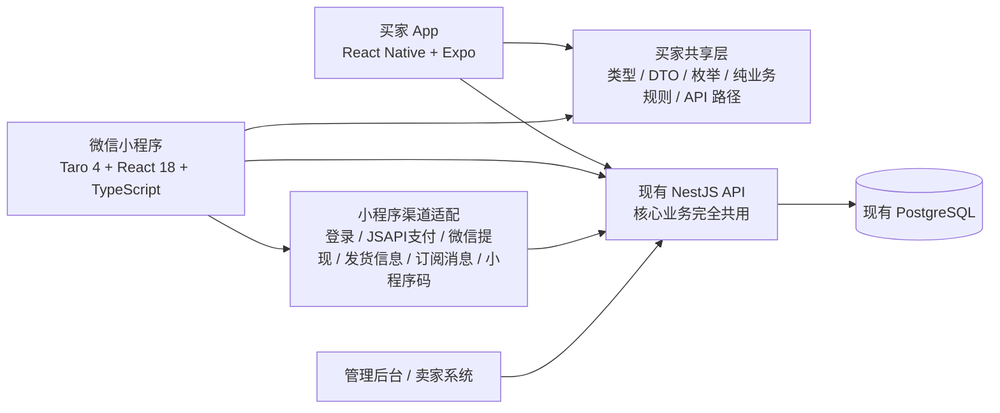
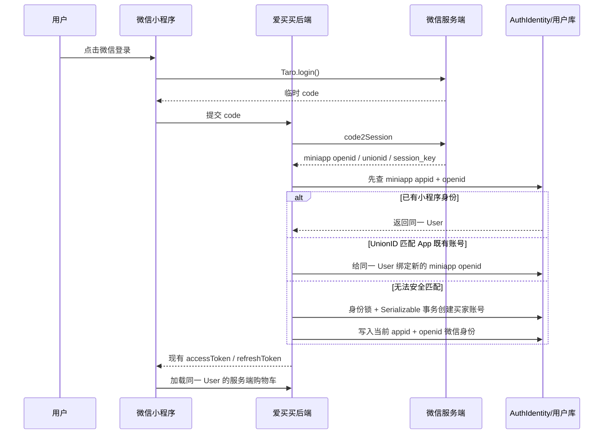

# AI爱买买微信小程序设计文档

> 状态：Phase 0～4 与商城订单自提本地代码已完成；原 71 页登录态巡检、自提新增路由局部巡检已完成；自提后端 staging 部署、真实资金、体验版与真机闭环待验收，尚未发布
> 日期：2026-08-04
> 目标：新增一个与 AI爱买买买家 App 基本等价的微信小程序，共用现有业务后端和数据库。
> 首版明确排除：独立 `app/delivery/**` 配送业务模块、支付宝支付、支付宝提现、Apple 登录及其他仅属于原生 App 的能力。这里的“配送模块”不等于普通商城订单的送货上门；普通商城继续支持 `DELIVERY`，并新增 `PICKUP` 到店自提。

## 1. 已确认的产品决策

| 决策项 | 结论 |
|---|---|
| 小程序名称 | 对外统一为“AI爱买买”；工程名、导航标题、登录/关于页、小程序专属协议、分享标题、扫码提示和隐私指引默认名称保持一致。旧域名兼容、企业法定名称及其他历史数据不因此改写 |
| 产品定位 | 微信小程序是 AI爱买买买家端的新渠道，不是一个新的独立业务系统 |
| 数据关系 | 小程序与 App 共用用户、商品、企业、购物车、订单、地址、售后、发票、会员、奖励、钱包、优惠券、推荐关系和数字资产等数据 |
| 后端关系 | 不复制后端、不复制数据库、不重做核心业务；只增加微信小程序渠道所必需的适配接口 |
| 后端改造授权 | 允许新增或修改小程序登录与账号合并、JSAPI 支付、跨端待支付、微信提现、微信发货上报及其必要字段、回调、幂等和安全逻辑；现有 App API 保持向后兼容 |
| 前端关系 | 小程序使用独立前端代码，不能直接编译 React Native App 页面 |
| 显示目标 | 信息架构、页面内容、品牌视觉、业务文案、状态和操作结果与当前 App 基本一致；微信原生控件和平台规范允许合理差异 |
| 首发范围 | 当前 App 对用户实际可见的功能全部纳入小程序首发范围，不因预判审核风险主动暂缓；如实际审核反馈要求整改，再按反馈另行决策 |
| 支付 | 小程序只提供微信支付，不展示支付宝支付 |
| VIP | 小程序支持 VIP 查看、购买、礼包选择和现有推荐权益，购买只使用微信支付 |
| 跨端待支付 | 不跨支付场景直接续付；先查原支付结果，确认未支付后安全关闭原交易，再创建当前渠道的新结算和支付 |
| 提现 | 小程序只提供微信提现到微信零钱；用户看到与 App 一致的统一钱包总额，所有现有可提现余额来源均可通过一个统一入口申请提现，不展示内部资金来源 |
| 税务与提现规则 | 沿用现有提现额度、扣款顺序、税率、冻结、失败退回和风控规则，不因切换到微信提现改变业务口径 |
| 退款规则 | 团购、VIP 及其他业务的退款与售后规则继续沿用当前 App 规则，本项目不主动调整 |
| 独立配送业务 | `app/delivery/**` 配送中心仍处于测试阶段，首版小程序不展示、不编译、不提交审核；普通商城订单的送货上门不在此排除项内 |
| 代码基线 | 生产功能范围以 `origin/main` 为准，开发和测试以最新 `origin/staging` 为准；小程序设计同时跟踪两者，但不得把未上线的配送带入首版 |

## 2. 当前代码基线与事实

设计时核对的远程分支：

| 分支 | 2026-08-02 核对提交 | 用途 |
|---|---|---|
| `origin/main` | `92d07c87ad357b075ce3f98458e1c6b7de6158d3` | 当前生产功能基线 |
| `origin/staging` | `325c4e1d414571b426c9eb41417effcb015d6a55` | 当前测试和后续开发基线 |

核对结果：

1. 两个远程分支的普通买家 App 页面清单一致。
2. `origin/staging` 额外存在完整的 `app/delivery/**`、`src/repos/delivery/**`、配送 Store、配送后端模块和配送法律文本；`origin/main` 没有这些代码。
3. 除配送外，两条分支还存在少量实现和测试差异，因此发布时应按经过测试的逻辑提交合并，不能用一个分支强行覆盖另一个分支。
4. 当前 App 主导航为三个 Tab：`首页`、`商品`、`我的`。小程序保持这三个 Tab 及其顺序。
5. App 当前技术栈为 React Native 0.81 + Expo 54 + React 19；小程序不能复用 React Native 组件树。

## 3. “基本一致”的验收口径

小程序与 App 的一致性分为四层：

### 3.1 必须一致

- 用户看到的商品、企业、库存、价格、优惠、奖励、订单、物流和售后数据。
- 页面信息结构、核心文案、按钮含义、状态标签和业务结果。
- 购物车、结算、支付后建单、退款、复购、会员、抽奖、推荐和钱包等业务规则。
- 登录后同一账号在 App 与小程序中的服务端数据。
- 当前 App 已经对用户开放的功能入口。

### 3.2 视觉上基本一致

- 沿用自然绿 `#2E7D32`、科技蓝、AI 青色、金色会员体系和现有间距、圆角、阴影、字号层级。
- 保持首页、商品页、我的页的模块顺序和内容优先级。
- 商品卡片、订单卡片、空状态、错误状态、骨架屏、弹层和底部操作区保持同一视觉语言。

### 3.3 允许平台差异

- 导航栏、TabBar、安全区、授权弹窗、支付收银台、分享面板、录音提示等使用微信允许的小程序方式。
- React Native 动画、原生 BottomSheet、原生地图和原生扫码组件需要重新实现，效果接近但不要求逐像素相同。
- 小程序受分包、隐私接口、订阅消息和交易运营规范约束，部分交互必须采用微信指定流程。

### 3.4 不应因为代码存在而自动上线

App 中存在但当前隐藏、下线或仅供调试的路由，不自动视为小程序首版功能。例如当前首页已关闭的 AI 短按多轮对话入口，应按真实可见入口对标，不能仅因代码文件存在就在小程序重新开放。

## 4. 第一版功能范围

### 4.1 功能对标矩阵

| 业务域 | App 能力 | 小程序首版处理 |
|---|---|---|
| 主导航 | 首页、商品、我的 | 完整对标，保持三个 Tab |
| 首页 | 品牌头部、购物车、搜索、AI 语音入口、VIP 礼包、商品和运营内容 | 完整对标，AI 录音改用小程序录音能力 |
| 商品发现 | 商品/企业切换、分类、筛选、推荐、附近/地图、分页加载 | 完整对标；地图只展示后端返回的企业公开坐标，不请求用户定位权限、不伪造坐标 |
| 搜索 | 商品、品类、企业搜索及近期搜索 | 完整对标，近期搜索保存在小程序本地 |
| 商品与企业 | 商品详情、SKU、库存、组合商品、企业详情、关注、用户/群组页面 | 共用现有 API，页面重新实现 |
| 购物车 | 登录后服务端购物车、赠品锁定、奖品、库存和选中状态 | 完整对标；与当前已移除游客模式的 App 一致，小程序不另建匿名业务购物车 |
| 结算 | 地址、优惠券、消费积分抵扣、运费、订单确认、待支付恢复 | 完整对标，只显示微信支付 |
| 支付 | App 微信支付、支付宝支付 | 小程序只实现微信 JSAPI/小程序支付 |
| 支付结果 | 支付成功、支付处理中、主动查单、支付后建单 | 完整对标；后端回调和主动查单为最终依据 |
| 订单 | 列表、详情、收货信息、物流、确认收货、取消、复购 | 完整对标 |
| 售后 | 退款、退货、换货、退货物流、售后详情 | 完整对标；退款沿用原订单微信支付通道 |
| 发票 | 抬头、申请、列表、详情、取消/状态展示 | 完整对标 |
| 团购 | 活动列表、详情、库存、结算、分享码入口 | 完整对标，分享改为小程序卡片/小程序码 |
| 抽奖 | 公开抽奖、中奖、奖品进入购物车、过期规则 | 完整对标 |
| VIP | VIP 信息、购买、礼包、多商品赠品、推荐权益 | 完整对标，只使用微信支付 |
| 我的 | 个人资料、公开编号、地址、关注、设置、外观、账号安全、注销 | 完整对标；权限和系统能力使用微信方式 |
| 钱包 | 消费积分余额、流水、抵扣信息 | 完整对标，Reward 与 Coupon 继续严格分离 |
| 提现 | App 当前支付宝提现 | 小程序改为微信提现；税务和代扣规则不变 |
| 优惠券 | 领券中心、我的优惠券、结算选择 | 完整对标 |
| 成长与任务 | 成长中心、消费记录；任务入口当前隐藏 | 对齐 App 当前真实可见入口；任务后端在行为证据链补齐前 fail-closed，不暴露演示任务或客户端自报领取 |
| 推荐关系 | VIP 推荐、普通分享、推荐用户、团长中心/申请 | 完整对标，入口参数改为小程序启动参数和 scene |
| 奖励树/排队奖励 | 奖励树、奖励队列、相关流水 | 完整对标 |
| 数字资产 | 累计消费数字资产中心 | 完整对标，仍独立于 Reward 和 Coupon |
| AI | 首页长按语音、语义推荐；仓库内另有当前重定向或隐藏的历史 AI 页面 | 共用 AI 后端；语音录音/上传使用小程序能力，推荐页保留预算、品类、产地、口味、主题和搭配语义，不恢复 App 当前不可见入口 |
| 智能客服 | 会话列表、聊天、快捷问题、评价、消息同步 | 完整对标；先验证 Socket.IO 在小程序 WebSocket 环境中的兼容性 |
| 消息中心 | 站内信、订单/系统/活动消息、详情和清理 | 站内信完整对标；外部提醒增加小程序订阅消息 |
| 扫码 | 推荐码、团购码和业务二维码识别 | 改用 `Taro.scanCode` |
| 法律与隐私 | 用户协议、隐私政策、会员服务协议、权限说明 | 内容对齐，并增加小程序渠道、微信接口和数据共享说明 |
| 独立配送业务 | `app/delivery/**` 全套功能 | 首版完全排除；未来单独评审后作为独立分包接入。普通商城 `DELIVERY / PICKUP` 双履约属于订单域，不使用这些接口或数据库 |

### 4.2 首版明确不包含

- 配送中心及配送账号、商品、购物车、订单、支付、清单、客服等全部配送能力。
- 支付宝支付和支付宝提现入口。
- Apple 登录。
- Expo OTA、应用商店下载、App 安装引导、Universal Link/App Link 和安装后延迟深度链接。
- App 专属的系统权限说明、原生 SDK 页面和原生更新提示。

## 5. 总体技术架构

小程序仍在当前 monorepo 内管理，新增独立前端工程，共用后端和共享纯 TypeScript 代码。



### 5.1 推荐目录

```text
根目录/
├── app/                         # 现有 React Native 买家 App
├── src/                         # 现有 App 组件、Repo、Store、主题和类型
├── miniapp/                     # 新增：微信小程序独立前端
│   ├── config/                  # Taro 开发/测试/生产配置
│   ├── src/
│   │   ├── app.config.ts
│   │   ├── app.tsx
│   │   ├── pages/               # 主包页面
│   │   ├── packages/            # 业务分包页面
│   │   ├── components/          # 小程序 UI 组件
│   │   ├── adapters/            # 登录/支付/存储/分享/录音/上传等平台适配
│   │   ├── repos/               # 调用现有 API 的小程序 Repo
│   │   ├── stores/              # 小程序状态
│   │   ├── theme/               # 从 App 设计令牌转换的小程序主题
│   │   └── config/              # 功能开关和渠道配置
│   ├── project.config.json
│   ├── package.json
│   └── tsconfig.json
├── packages/
│   └── buyer-shared/            # 后续逐步抽取的无平台依赖共享代码
│       └── src/
│           ├── contracts/       # 请求/响应类型、DTO
│           ├── domain/          # 业务实体类型
│           ├── constants/       # 枚举、状态文案、API 路径
│           ├── rules/           # 纯计算和业务展示规则
│           └── feature-manifest.ts
├── backend/                     # 现有 NestJS 后端 + 小程序渠道适配
├── admin/                       # 现有管理后台
└── seller/                      # 现有卖家系统
```

### 5.2 为什么放在 `miniapp/`

- 与 `app/`、`admin/`、`seller/`、`backend/` 同仓库，前后端接口变更可以在同一提交或同一 PR 中检查。
- 小程序拥有独立依赖、构建、测试和发布版本，不污染 Expo/React Native 环境。
- 不另建 Git 仓库，避免 App、后端和小程序版本脱节。
- 将来配送上线时，可以增加独立配送分包，而不需要重建项目。

## 6. 技术选型

### 6.1 小程序前端

| 项目 | 选择 | 说明 |
|---|---|---|
| 框架 | Taro 4 | React 团队容易接手，适合当前 TypeScript/React 技术体系 |
| 当前初始化版本 | `@tarojs/* 4.2.1` | 2026-08-02 从 npm 核对的当前版本，初始化时统一锁定同一精确版本 |
| React | React 18 | Taro 4.2.1 的 React 插件当前声明 React 18 peer dependency；不要直接把 App 的 React 19 复制进来 |
| 语言 | TypeScript strict | 与现有项目保持一致 |
| 状态 | Zustand | 保留现有思路，但 Store 不直接引用 React Native 存储 |
| 服务端状态 | TanStack Query | 复用 query key、缓存和失效策略的设计 |
| 表单 | react-hook-form + zod（经小程序兼容验证后使用） | 复用校验规则，首个复杂表单做兼容性验证 |
| 样式 | SCSS/CSS Modules + 设计令牌 | 不复制 React Native `StyleSheet` |
| 请求 | `Taro.request` / `Taro.uploadFile` 适配器 | 保持现有 `Result<T>` 返回模式和 Token 刷新机制 |

### 6.2 不直接复用的 App 依赖

以下能力需要小程序重新实现：

- `react-native`、`expo-router`、`expo-image`、`expo-linear-gradient`。
- `expo-av`、`expo-camera`、`expo-image-picker`、`expo-clipboard`。
- `expo-secure-store`、`AsyncStorage`、`expo-linking`、`expo-updates`。
- `react-native-wechat-lib`、`@uiw/react-native-alipay`。
- React Native BottomSheet、Gesture Handler、Reanimated 动画和原生 SVG/二维码组件。

### 6.3 可以逐步共享的代码

- `src/types/domain/**` 中不依赖 React Native 的类型。
- 后端 DTO 对应的请求/响应 Contract。
- 商品、订单、库存、售后、钱包等枚举和状态文案。
- 价格格式化、库存展示、团购倒计时、复购结果、组合商品快照等纯函数。
- API 路径、Query Key、功能开关定义和通用错误结构。
- Zod 校验规则中不依赖平台 API 的部分。

首期不要先大规模移动 App 文件。采用“遇到需要双端使用的纯代码再抽取，并同时补测试”的渐进方式，降低破坏现有 App 的风险。

## 7. 页面与分包设计

### 7.1 主包

主包只保留冷启动和高频入口：

- `pages/home/index`：首页。
- `pages/goods/index`：商品页，对应 App 当前 `museum.tsx`，对用户统一显示“商品”。
- `pages/me/index`：我的。
- 登录/注册弹层、隐私授权、全局错误页。
- TabBar、全局主题、请求层和最小公共组件。

### 7.2 建议分包

| 分包 | 页面范围 |
|---|---|
| `packages/commerce` | 搜索、分类、商品详情、企业详情、用户/群组、购物车、结算、地址选择、优惠券选择、支付结果 |
| `packages/orders` | 订单列表/详情、收货信息、物流、售后申请/详情、发票抬头/申请/详情、团购订单链路 |
| `packages/member` | 资料、地址、关注、钱包、提现、优惠券、VIP、礼包、抽奖、成长、任务、推荐、团长、奖励树、排队奖励、数字资产、设置、安全、注销和法律文本 |
| `packages/ai-service` | AI 语音/推荐/溯源/历史/财务页面、智能客服、消息中心 |
| `packages/share` | VIP 推荐、普通分享、团长码、团购码、小程序码落地页和扫码解析 |

分包边界在第一次构建后用微信开发者工具分析包体再调整；具体大小限制以提交审核时微信后台的当期规则为准。

### 7.3 配送预留方式

- 首版 `app.config.ts` 中不存在任何配送路由和配送分包配置。
- `feature-manifest.ts` 中保留 `delivery: false`，但首版代码不能通过动态隐藏方式偷偷打入包内。
- 未来配送准备上线时，新建 `packages/delivery`，重新完成产品范围、账号、支付、隐私、类目和审核设计。
- 普通商城小程序不得直接引用 `src/repos/delivery/**` 或配送数据库接口。

## 8. 小程序渠道适配设计

### 8.1 微信登录与账号合并

当前 App 的 `/auth/oauth/wechat` 使用移动应用/H5 OAuth 换取身份；小程序的 `Taro.login` 授权码必须由服务端调用 `code2Session`，两者不能混用。

小程序只提供微信身份登录，不复制 App 的手机号验证码、密码登录、注册和忘记密码表单。登录页仅保留协议确认与“微信一键登录”；业务页面触发登录时统一携带受限的站内 `returnUrl` 进入该页，成功后返回原页面。

接口：

```text
POST /api/v1/auth/oauth/wechat-miniapp
body: { code: string }
response:
  - 已匹配小程序身份或 UnionID：复用现有 User 的 AuthSession
  - 无可安全匹配身份：直接创建微信买家账号并返回 AuthSession
```

账号匹配顺序：



安全边界：

- 小程序 OpenID 与 App OpenID 通常不同，必须按 AppID 存储，不能把两个 OpenID 当成同一个值。
- 小程序应绑定到与 App 相同的微信开放平台主体，优先使用 UnionID 关联。
- UnionID 不可用且没有现有 `appid + openid` 身份时，创建新的微信买家账号；禁止仅凭客户端手机号或昵称静默合并既有账号。
- `session_key`、AppSecret 和 OpenID 查询逻辑只保留在服务端，不能返回或写入前端日志。
- 现有 `AuthIdentity` 已具备 `identifier`、`unionId`、`appId` 的建模基础，优先复用；是否增加渠道审计字段在实现前通过 Schema 审查决定。
- 只有微信开放平台返回相同 UnionID 或已经存在同一小程序身份时，App 与小程序才复用同一个 `User.id`；仅有手机号 App 账号但没有可验证微信统一身份时不能自动识别为同一人。
- 首次微信登录创建账号和写入微信身份必须处于同一个 Serializable 事务，并使用跨进程身份锁，防止并发重复建号；注册红包和成长事件使用现有幂等机制触发。
- 旧版本遗留的手机号小程序 Session 在水合时立即清除，支付、提现和其他受保护页面只接受 `loginMethod=wechat-miniapp`。
- 微信 `wx.login` 只提供服务端换取身份所需的临时 code，不等于获取用户头像和昵称；首次账号使用非敏感兜底资料，用户登录后可自愿完善。

2026-08-10 首次真实联调修复：staging 的 500 根因是 PM2 运行环境缺少 `WECHAT_MINIAPP_APP_ID` / `WECHAT_MINIAPP_APP_SECRET`。测试服务器已从本地密码本安全补齐并以 `WECHAT_MINIAPP_MOCK=false` 重载；秘密值不写入 Git、前端代码或日志。production 仍须在发布前独立配置和验收。

### 8.2 微信小程序支付

当前 `WechatPayService.createAppOrder()` 使用 APP 下单能力；小程序必须新增 JSAPI/小程序下单，不能复用 APP 调起参数。

后端适配：

1. 新增 `WechatPayService.createMiniProgramOrder()`，调用 `/v3/pay/transactions/jsapi`。
2. 后端从已认证用户的 miniapp `AuthIdentity` 取得当前 AppID 下的 OpenID，禁止由前端自由传入 OpenID。
3. 复用现有 `CheckoutSession`、`PaymentChannel.WECHAT_PAY`、金额校验、支付回调、主动查单、关单、退款和支付后原子建单逻辑。
4. 为小程序生成 `timeStamp`、`nonceStr`、`package=prepay_id=...`、`signType=RSA` 和 `paySign`。
5. 小程序调用 `Taro.requestPayment()`；前端成功回调只代表收银台调用结束，仍需查询后端支付结果。
6. 用户取消支付继续进入现有待支付/续付逻辑，不创建订单。
7. 微信支付回调和主动查单确认支付后，继续在 Serializable 事务中执行支付后建单、库存、奖励和快照逻辑。

渠道识别应由小程序登录产生的可信会话或独立小程序支付端点决定，不能仅相信可伪造的请求头。

#### 8.2.1 跨端待支付处理

App 微信支付、App 支付宝支付和微信小程序支付属于不同支付渠道或支付场景，原支付单生成的调起参数不能跨端复用。跨端处理遵循以下确定规则：

1. `CheckoutSession` 或独立支付尝试记录必须保存可信的 `PaymentScene`，至少区分 `APP` 与 `MINI_PROGRAM`。
2. 用户可以在另一端看到尚未完成的结算摘要、金额和剩余有效时间，但不能直接调用原支付场景的“继续支付”。
3. 页面提供“取消原支付并在当前端重新支付”，不得在相同商户单号下静默切换支付渠道或支付场景。
4. 后端先主动查询原支付单；如果已经支付，立即按现有安全逻辑完成支付后建单并返回成功，禁止再创建新支付单。
5. 确认未支付后，调用原渠道关单；只有关单结果明确成功后，才能取消原 `CheckoutSession` 并创建新的当前端结算及新商户单号。
6. 查询、关单或网络结果不确定时保持处理中并继续补偿查询，禁止为了让用户继续操作而直接生成第二笔支付。
7. App 发起后到小程序重付、小程序发起后到 App 重付采用同一套对称规则。

### 8.3 订单发货信息管理

爱买买属于交易类小程序。微信支付官方当前要求交易类小程序按规范接入订单发货管理，否则可能限制正式环境的小程序支付权限。

需要增加微信订单发货适配服务：

- 支付成功后关联微信支付单号/商户单号与爱买买订单。
- 卖家发货或平台生成顺丰运单后，幂等上报发货信息。
- 多商户/多包裹订单按微信允许的结构上报，内部订单拆分规则保持不变。
- 取消、退款、退货、换货和确认收货时同步对应状态。
- 上报失败进入重试/补偿队列，不能阻断爱买买内部正常发货事务。
- 管理后台增加只读的微信发货上报状态和失败重试入口，方便运营排查。

该适配可能影响微信侧结算时间，但不改变爱买买内部订单、商户结算和售后规则；上线前需要财务和运营确认微信交易结算周期。

2026-08-02 实现状态：卖家/管理端发货事务会为 `WECHAT_PAY + MINI_PROGRAM` 结算写入持久化 `WechatShippingOutbox`；后台任务用租约和 CAS 抢占后调用微信 `/wxa/sec/order/upload_shipping_info`。上报按 CheckoutSession 聚合同一支付下的多商户、多订单和多包裹，使用微信支付单号与精确付款 OpenID，失败重试不回滚爱买买内部发货。管理端订单详情显示上报状态与错误，并允许有发货权限的管理员重新从当前订单构建可信快照后入队。真实上报仍需微信交易发货权限、承运商编码和平台白名单联调。

### 8.4 微信提现到零钱

“钱包余额转入微信零钱”在技术上不是用户本地钱包互转，而是爱买买平台通过微信支付商家转账能力向用户微信零钱出款。

现状：

- Prisma 已有 `WithdrawChannel.WECHAT` 枚举。
- 当前买家提现 DTO、App 提现页和付款服务实际上只实现支付宝账户、支付宝姓名和支付宝转账。

小程序适配：

1. 提现页只展示“提现到微信零钱”和统一钱包总额，不向用户展示 VIP、普通奖励、团购返利或其他内部资金来源拆分。
2. 所有当前已计入可提现总额的余额来源均允许从这个统一入口申请微信提现。
3. 用户只提交一次提现申请和一个金额；后端继续按现有资金来源优先级完成余额扣减，Provider 如需内部子单，由后端聚合展示最终状态。
4. 提交 `channel=WECHAT`，不要求用户填写支付宝账号或实名姓名输入框。
5. 后端根据当前小程序 AppID 获取已绑定的 OpenID。
6. 复用现有提现额度、可用余额、冻结、税务代扣、风控、幂等和审核规则，税率与现有 App 保持一致。
7. 新增微信商家转账 Provider，记录微信转账单号、必要的内部子单和 Provider 状态。
8. 如果返回待用户确认，小程序调用微信官方的用户确认收款能力。
9. 以后端回调/主动查询为准，将统一提现申请推进到成功、失败或处理中；内部存在多个 Provider 子单时，全部成功才记为整体成功。
10. 网络超时、`SYSTEM_ERROR` 等不确定结果必须使用原商户单号查询或重试，禁止创建新单号造成重复出款。
11. 涉及余额扣减、退回和最终入账状态的操作继续使用 Serializable 事务和幂等键；部分子单失败时只退回对应未出款金额，禁止多退或少退。

产品范围不因预判审核结果而缩减；实现和真实联调仍需要商户号具备可调用的微信商家转账能力。若外部能力尚未开通，则将其作为完整首版发布阻塞项，不把微信提现从首发需求中删除。

2026-08-13 商家转账额度规则已按微信商户平台获批的“佣金报酬”（`1005`）场景固化：

1. 微信对实际转账金额规定单笔 ¥0.10–¥200。小程序用户填写税前申请金额；现行 20% 扣缴、无通道费时，页面与后端强制 ¥0.12–¥200，若税费变化则由后端逐分重算最低申请额。
2. 沿用统一钱包 20% 扣缴规则；¥200 申请金额预计 ¥160 到账。前端只做同口径预估，创建申请时后端重新读取规则裁决。
3. 同一用户每日实际到账 ¥2,000、商户平台每日实际到账 ¥50,000，按中国自然日和真实提交给微信的到账金额裁决；`PROCESSING` 与 `PAID` 均占用原发起日额度。
4. 日额度裁决位于 Serializable 提现事务、钱包冻结之前；全平台额度使用事务 advisory lock。额度已用完时统一提示次日再提。
5. `1005` 必须且只能使用“岗位类型=平台推广人员”“报酬说明=AI爱买买平台推广佣金”，收款感知固定为“劳务报酬”；任一值漂移时禁止发起新转账。
6. 关闭新建开关只阻止创建新单，不关闭回调验签、主动查单和撤销；存量 `PROCESSING` 单据必须继续进入成功或失败终态。用户关闭微信确认页后只能查询并恢复原单，不得再次冻结或创建新转账。

### 8.5 分享、推荐和小程序码

App 当前的系统分享、H5 下载页、Universal Link、剪贴板口令和设备指纹延迟匹配，不直接搬入小程序。

小程序采用：

- `onShareAppMessage` / Taro 分享能力生成微信分享卡片。
- 分享路径携带经过校验的 VIP 推荐码、普通分享码、团长码、团购码或活动 ID。
- 冷启动和热启动统一解析 `query`、`scene`、分享来源及二维码场景值。
- 未登录时把待绑定码存入小程序本地；登录完成后调用现有对应绑定 API。
- 服务端调用微信小程序码接口生成无限码，Redis 缓存微信 access token 和可复用结果。
- 不混淆 VIP 推荐、普通分享、团长关系和团购活动四种业务语义，继续调用各自现有后端接口。
- scene 内容只使用短 token，服务端解析真实参数，避免超长和参数伪造。

2026-08-02 实现状态：推荐、普通分享、团长和团购分别使用服务端随机 scene token；服务端先验证目标路由白名单，再生成并校验 PNG 小程序码。客户端按当前账号 revision 保存临时码，账号切换后会丢弃并删除旧账号异步产物，扫码和冷/热启动统一进入白名单场景解析页。

### 8.6 消息中心与订阅消息

- 现有站内消息和会话数据继续使用 `InboxRepo`/客服后端，保持跨 App、小程序一致。
- 小程序外部提醒使用订阅消息，不照搬 App Push。
- 订阅授权应在“支付完成、申请售后、申请提现”等用户能够理解的动作附近请求，不能一进入首页就集中索取。
- 首批建议模板：订单发货、退款/售后结果、提现结果；营销模板另行审核，不与服务通知混用。
- 服务端保存模板 ID、授权结果和发送日志，失败不得改变内部订单或提现状态。
- 当前 App 的通知设置主要是本地 UI 状态；实施小程序时应把“站内消息开关”和“微信订阅授权状态”分开显示，不能假装系统级授权已经持久化。

2026-08-02 实现状态：订单发货、售后结果和提现结果已接入一次性订阅消息授权、服务端 consent 消费、outbox 重试和发送审计。一次授权对应同模板最先发生的一次事件，不承诺绑定到某个具体订单/售后单；内部业务状态不依赖外部消息发送结果。模板 ID 和字段映射为空时 fail-closed。

2026-08-11 外部推荐入口：App 生成的统一二维码仍为 `https://app.ai-maimai.com/invite/{code}`。该网页不登录；微信扫一扫后由用户显式点击“打开爱买买小程序”，网页后端核验同一次落地事件中的推荐码并调用微信 URL Link 生成接口，目标为 `/packages/referral/landing/index?code={code}&kind=normal|vip`。小程序在该页完成一次微信登录后调用既有推荐绑定接口。URL Link 生成失败、缺少小程序平台凭据或非微信环境时必须留在网页并提供 App 下载入口；不得自动唤起小程序，也不得把微信接口返回的非 `https://*.wxaurl.cn` 地址重定向给用户。微信官方要求 URL Link 的目标页面必须已发布；且在微信内打开时 `env_version=trial/develop` 不生效。因此本链路在微信内始终依赖已发布版中存在该推荐落地页，不能用测试环境的 `trial/develop` 参数替代这一发布前置条件。生产发布前仍需在微信平台开通并验证 URL Link、发布包含该页面的小程序版本、配置 `WECHAT_MINIAPP_APP_ID/SECRET`，并在真实微信设备上验收。

### 8.7 AI 语音、上传和智能客服

AI 语音：

- 使用 `Taro.getRecorderManager()` 录制微信允许的音频格式。
- 使用 `Taro.uploadFile()` 上传到现有 AI 音频接口。
- Phase 0 必须用真机验证音频编码、时长、文件大小、ASR 识别率和超时重试。
- 复用现有 AI 意图识别、搜索、推荐、购物车确认和操作结果，不在小程序复制 AI 业务逻辑。

智能客服：

- 现有 App 使用 `socket.io-client`；先验证在目标微信基础库中的 WebSocket、鉴权头、重连、心跳和前后台切换。
- 优先使用 WebSocket-only 传输并配置合法 `wss` 域名。
- 如果 Socket.IO 客户端无法稳定运行，再增加小程序 WebSocket 协议适配层；在验证前不能承诺仅靠换前端库即可完成。
- 实时连接失败时仍可通过现有 REST 会话/消息接口拉取，避免客服页面完全不可用。

## 9. 状态、请求和本地存储

### 9.1 请求层

小程序 `ApiClient` 保持现有约定：

- 基础路径仍为 `/api/v1`。
- 所有 Repo 返回统一的 `Result<T>`。
- 自动附加买家 JWT。
- 多个并发 401 只执行一次 refresh token。
- 刷新失败后清理用户态、Query 缓存和敏感本地数据。
- 普通请求、文件上传和 WebSocket 分别配置合法域名。
- GET 缓存、超时、取消和错误文案按小程序网络行为重新实现。

### 9.2 Token 与本地数据

- 小程序使用 `Taro.setStorage` 封装持久化，不能声称其安全性等同于 iOS Keychain/Android EncryptedSharedPreferences。
- 前端不保存微信 AppSecret、商户私钥、APIv3 Key、session_key 或原始支付证书。
- Refresh token 支持服务端撤销、轮换和设备会话管理。
- 近期搜索、待绑定分享码和外观设置可以本地保存；购物车只使用登录用户的服务端数据。
- 登录后的订单、余额、奖励、地址等权威数据一律来自服务端，不能以本地缓存作为资金或状态裁决依据。

### 9.3 跨端同步边界

| 数据 | App 与小程序是否同步 | 说明 |
|---|---|---|
| 登录后购物车 | 是 | 同一 User 的服务端购物车；App 与小程序读取同一份业务数据 |
| 匿名购物车 | 不适用 | 当前 App 已移除游客模式，小程序同样不创建匿名业务购物车 |
| 订单/售后/发票/物流 | 是 | 服务端权威数据 |
| 钱包/奖励/优惠券/VIP/数字资产 | 是 | 服务端权威数据，体系边界不变 |
| 地址/资料/关注/推荐关系 | 是 | 账号正确合并后同步 |
| 最近搜索/外观设置 | 默认不同步 | 当前属于渠道本地体验；如以后需要跨端同步再增加服务端配置 |
| 微信订阅授权 | 仅小程序 | 微信平台授权，App 无对应状态 |

## 10. UI 与交互规范

### 10.1 设计令牌

小程序建立与 App 一一对应的主题 Token，而不是在页面散落硬编码：

- 主色：`#2E7D32`。
- AI 色：`#00897B` → `#00BFA5`。
- 金色：`#D4A017`。
- 背景：`#FAFCFA`，卡片 `#FFFFFF`。
- 间距沿用 2/4/8/12/16/20/24/32/40/56 体系。
- 字号、圆角、阴影、状态色从 `src/theme/**` 映射后固化在 `miniapp/src/theme/**`。

### 10.2 组件对标

| App 组件 | 小程序组件 |
|---|---|
| `Screen` / `AppHeader` | 页面容器 + 自定义导航栏/微信导航栏适配 |
| `ProductCard` / `CompanyCard` / `OrderCard` | 同结构 Taro 组件，保持字段、文案和状态一致 |
| `AppBottomSheet` | 微信兼容的 Popup/底部弹层 |
| `FlashList` / RN ScrollView | Taro `ScrollView`、分页和虚拟列表方案 |
| `expo-image` | Taro `Image`，启用懒加载、占位和裁剪策略 |
| `SpinWheel` / AI 动效 | CSS 动画或 Canvas，真机性能不达标时降级但保持业务结果 |
| `RegionPicker` | 小程序 Picker/自定义地区选择器，共用地区数据 |
| `MapView` | 小程序 Map 组件；首版只用企业公开坐标，不申请用户定位权限 |
| Toast/Empty/Error/Skeleton | 小程序统一反馈组件，所有列表保持三态 |

### 10.3 可访问性和适配

- 适配胶囊按钮、状态栏、安全区、横竖屏策略和不同微信字体设置。
- 价格和长编号必须允许收缩/换行，不能溢出卡片。
- 关键按钮至少保持可点击高度和足够间距。
- 深色模式按 App 当前外观能力逐页适配，不以简单反色代替设计。
- iOS 和 Android 微信真机都必须验收，开发者工具截图不能代替真机。

## 11. 环境、分支与版本管理

### 11.1 环境对应

| 小程序环境 | 代码来源 | API | 微信侧用途 |
|---|---|---|---|
| 本地开发 | 工作分支 | 本地 API 或测试 API | 微信开发者工具/开发版 |
| 测试 | `staging` | `https://test-api.ai-maimai.com/api/v1` | 开发版、体验版、测试数据 |
| 生产 | `main` | `https://api.ai-maimai.com/api/v1` | 审核版和正式版、真实数据 |

开发者工具中“忽略合法域名校验”只能用于本地开发，体验版和正式版必须使用已配置的 HTTPS/WSS 合法域名。

### 11.2 分支策略

- 小程序不建立长期独立分支，继续使用全项目 `staging` → `main` 流程。
- Codex 实施阶段使用短期分支，例如 `codex/wechat-miniapp-foundation`、`codex/wechat-miniapp-commerce`。
- 每个 Phase 拆成小提交，前端、后端适配、测试和文档范围清晰，方便单独回退。
- 所有功能先进入 `staging`，连接测试 API，在微信体验版验证；验收通过后才进入 `main`。
- `git push`、上传体验版、提交审核和正式发布都是不同动作，均需用户明确确认。

### 11.3 版本号

- `miniapp/package.json` 使用独立语义版本，例如 `1.0.0`。
- Git 发布标签使用 `miniapp-v1.0.0`，与 App 的版本号互不强绑。
- 微信上传版本备注必须包含版本号、Git SHA、API 环境和主要改动。
- 后端接口保持向后兼容：新增可选字段或新端点，不能为了小程序破坏已发布 App。
- 如必须进行不兼容 API 变更，应新增 `/api/v2` 或提供兼容期，不允许 App 和小程序在发布窗口互相阻塞。

### 11.4 以后一个前端需求如何同步两端

| 改动类型 | 处理方式 |
|---|---|
| 纯业务规则/类型/API Contract | 优先修改 `packages/buyer-shared` 一次，再验证 App 和小程序 |
| 页面结构或视觉同时变化 | 同一个需求下建立 App 子任务和 Miniapp 子任务，分别修改两套 UI，使用同一验收截图/字段清单 |
| 后端字段变化 | 同一提交先改后端兼容字段和共享 Contract，再改两个前端 Repo/页面 |
| 仅 App 能力 | 只改 App，并在 feature manifest 标注 `appOnly` |
| 仅小程序能力 | 只改 Miniapp，并标注 `miniappOnly` |
| 配送能力 | 独立需求，不得顺带打开小程序配送功能 |

每个买家端需求的 PR/任务必须包含“渠道影响”检查：

```text
[ ] App 是否需要修改
[ ] 微信小程序是否需要修改
[ ] 共享 Contract/纯业务规则是否需要修改
[ ] 后端是否保持向后兼容
[ ] 配送是否明确排除或单独评审
[ ] 两端文案、状态和异常路径是否一致
```

### 11.5 小程序新增环境变量

- 前端构建：`TARO_APP_ENV`、`TARO_APP_API_BASE_URL`、`TARO_APP_WS_BASE_URL`、`TARO_APP_USE_MOCK`；staging/production 构建禁止 Mock 和非 HTTPS/WSS 地址。
- 小程序平台：`WECHAT_MINIAPP_APP_ID`、`WECHAT_MINIAPP_APP_SECRET`、`WECHAT_MINIAPP_MOCK`、小程序码 `WECHAT_MINIAPP_CODE_*`。
- 订阅消息：三组 `WECHAT_MINIAPP_SUBSCRIBE_*_TEMPLATE_ID/FIELDS` 及 `WECHAT_MINIAPP_SUBSCRIBE_STATE`。
  - 2026-08-11 微信后台实际模板：订单发货 `AaefuI_Uqp1qvX7fNuGbEe3w6Qe4b4M5SUpboeLXvNQ`（`character_string6/phrase18/thing5/date4`）；售后状态 `sAQM7NcmYHH6x1nxlqr_Fy2EBushICGBCt42XPsG04Q`（`character_string7/thing2/thing5/time12`）；提现结果 `2zKL7siL8vg7U8t31koS272-CQBxTz9ePaXoi1vXAYU`（`phrase2/thing4/time3`）。部署环境必须使用 `backend/.env.example` 中同名字段映射，禁止沿用占位 keyword。
- 支付与提现：沿用 `WECHAT_PAY_*`，新增/启用 `WECHAT_TRANSFER_*`；支付 JSON API 必须配置 `WECHAT_PAY_PUBLIC_KEY_ID` 和 `WECHAT_PAY_PUBLIC_KEY`（或 `WECHAT_PAY_PUBLIC_KEY_PATH`），生产缺任一必需凭据即 fail-closed。微信支付公钥不是 AppSecret、APIv3 Key 或商户私钥，不能混填。
- 头像白名单：`AVATAR_ALLOWED_URL_PREFIXES` 仅在平台上传域名无法由现有上传配置推导时补充，禁止将任意第三方图片 URL 保存为头像。

AppID `wx1b33112db0d5267b` 已写入 `project.config.json`，可用于开发者工具和上传体验版；AppSecret、支付密钥和证书等秘密值只进入部署环境或 Secrets，禁止写入小程序代码或 Git。

## 12. 安全、资金与合规

### 12.1 资金安全

- 小程序支付金额、优惠、消费积分、运费和商品状态均由服务端重新计算，不能信任前端价格。
- 支付回调必须验签解密；支付成功、退款成功和提现成功以服务端回调/查询结果为准。
- 支付后建单、余额扣减、奖励发放、提现冻结/退回继续使用 Serializable 事务。
- 支付、退款、提现、发货上报和小程序码生成均有稳定幂等键。
- 不确定的微信出款结果先查单，禁止重新生成业务单号。

### 12.2 账号安全

- 登录 code 只使用一次并设置很短的服务端 ticket 有效期。
- 账号合并必须验证 UnionID 或手机号，不允许客户端指定目标 User ID。
- 小程序用户注销后，沿用现有即时注销、身份释放和资金/履约阻断规则。
- 新增小程序认证和资金接口必须接入限流、审计日志、异常告警和敏感字段脱敏。

### 12.3 小程序合规

产品已确认不因预判审核风险删减当前 App 可见功能；如微信实际审核提出整改要求，再依据具体反馈另行决策。技术接入仍至少完成：

- 小程序主体认证、备案及符合业务内容的服务类目。
- 微信开放平台绑定，使 App 与小程序具备合法的 UnionID 关联条件。
- 小程序 AppID 与现有微信支付商户号绑定，并开通 JSAPI/小程序支付权限。
- 配置 request、upload、download、socket 合法域名。
- 配置微信隐私保护指引，按实际使用声明手机号、位置、相册、摄像头、麦克风等接口。
- 接入交易类小程序订单发货管理。
- 更新爱买买隐私政策和用户协议，写明小程序渠道、微信平台能力、账号合并和数据共用。
- 配置实际业务所需的订阅消息模板、商家转账和营销能力；实际审核反馈进入后续整改清单，不在开发前主动移除对应产品功能。

所有 AppSecret、APIv3 Key、商户私钥、证书和 CI 上传私钥只放环境变量、GitHub Secrets 或本地 `docs/operations/密码本.md`，任何可提交文档只能写占位符。

## 13. 测试与验收

### 13.1 自动化测试

- 共享层：类型检查和纯业务规则单元测试，两端使用相同用例数据。
- 小程序：页面/组件测试、Repo 测试、Store 测试、路由和功能开关测试。
- 后端：小程序登录、账号合并、JSAPI 下单、回调、查单、关单、退款、提现和发货上报单元/集成测试。
- Contract 测试：后端 DTO 与 App/Miniapp 类型、HTTP method、path 和枚举一致。
- 安全测试：code 重放、账号错误合并、OpenID 越权、金额篡改、重复回调、重复提现和并发结算。

2026-08-04～2026-08-09 验证快照：

- 小程序 ESLint 0 警告、TypeScript、37 个 Vitest 文件 210 个用例、staging 和 production 两套 Taro 微信构建全部通过；生产产物自动检查确认 71 个页面、分享/隐私事件、真实 AbortController polyfill、生产域名和首版范围正确，主包 1.235 MiB、总包 2.293 MiB、最大分包 0.194 MiB。
- 合并 `origin/staging` 后的最终回归：后端 Nest 构建、主库与配送库 Prisma validate 通过；全量 Jest 302 个套件、3234 个用例通过，另有仓库既有 2 个套件/5 个用例标记跳过；根 App TypeScript、39 个 Jest 套件/152 个用例和 208 个源码与合规测试均通过；配送管理端 25/25、配送卖家端 30/30 合同测试及两端生产构建通过。小程序首版仍由范围守卫排除配送。
- 2026-08-04 当时的 111 个 Prisma 迁移已在临时 PostgreSQL 16 空库按顺序执行并确认无待迁移项；合并后新增迁移的真实 staging 部署仍按 WMP00-F 外部发布门禁执行，本轮仅完成主库/配送库 schema validate 与客户端 generate。
- CI 已增加小程序范围守卫、类型/测试、双环境构建，并在 production 构建后执行同一套产物断言；部署 E2E 改为 `prisma migrate deploy`，避免生产式流程使用 `db push`。
- 2026-08-08 资金安全复核补强：微信支付 APIv3 JSON 应答改为原始 body 验签后解析，关单只接受签名 204/明确终态；提现补偿按到期公平调度并由人工/Cron CAS 抢占；微信交易发货发送前重建订单快照。新增聚焦资金回归 8 套件 262/262 通过，完整最终验证以本节后续交付快照为准。
- 2026-08-10 登录态开发者工具复核：47 个 Vitest 文件 249/249、ESLint 0 警告、TypeScript、staging/production 双构建和生产产物断言全部通过；生产包 71 页、主包 1.255 MiB、总包 2.307 MiB、最大分包 0.213 MiB。构建结束后会对 Taro 4.2.1 生成的 `base.wxml` 做 fail-closed 兼容修正并再次断言，删除微信 WebView 不支持的 `scroll-view padding` 属性；最终仍重新构建 staging，避免开发者工具误连生产 API。
- 2026-08-10 完整 fixture 复核：新增 `backend/scripts/miniapp-runtime-fixtures.ts`，仅在同时满足显式 staging 开关、固定确认短语、数据库名精确为 `testaimaimai`、目标 `userId + buyerNo` 与数据库 ACTIVE 买家一致时，才创建固定 ID、可重复清理的地址/订单/微信小程序支付记录/物流/售后/发票/拼团/场景数据。登录态微信开发者工具最终 71/71 `PASS`、0 `NO_FIXTURE`、0 `AUTH_GATE`、0 `FAIL`、0 warning；审计后 18 类临时主表和关联表记录全部复查为 0，远端临时执行脚本已删除。最终小程序 ESLint 0 警告、TypeScript、47 个 Vitest 文件 250/250、staging/production 双构建和 71 页生产产物断言通过；后端 fixture 守卫 5/5、主库 Prisma validate 与 Nest 构建通过。该结果验证页面渲染、真实 staging 读取和路由参数，不等于真实付款、退款、提现、订阅、发货或真机权限已验收。
- 小程序依赖审计仍有 14 条 Taro/构建链上游公告；2026-08-08 已把可独立安全升级的间接依赖 `nanoid` 从 3.3.16 更新到 3.3.18，消除该项 High。生产微信包不包含剩余公告涉及的 Swiper JS，开发服务器不得暴露公网。当前不存在不破坏 Taro 4.2.1 依赖约束的自动升级路径，按 `WMPF08` 跟踪兼容升级，禁止使用 `npm audit fix --force`。完整发现、修复与外部验收边界见 `docs/issues/wechat-miniapp-full-audit-2026-08-04.md`。

### 13.2 真机关键链路

1. 新微信用户注册并创建爱买买账号。
2. 现有 App 微信用户在小程序自动识别同一账号。
3. 现有手机号用户验证手机号后合并，历史订单和余额完整出现。
4. 未登录用户被引导登录，登录后加载同一 User 的服务端购物车且不重复。
5. 普通商品、组合商品、团购和 VIP 礼包微信支付闭环。
6. 用户取消支付、支付处理中、回调延迟、主动查单和重复回调。
7. 发货、物流、确认收货、复购、退款、退货和换货。
8. 消费积分抵扣、优惠券叠加和 VIP 禁止抵扣规则。
9. 微信提现待确认、确认成功、拒绝/失败、超时和重复请求。
10. VIP 推荐、普通分享、团长码、团购码四种入口不串关系。
11. AI 录音上传、识别、失败重试和授权拒绝。
12. 客服前后台切换、断网重连、消息补拉和站内消息同步。
13. iOS/Android 微信不同字体和安全区下的页面显示。
14. 全局搜索确认小程序不存在配送入口、配送路由和支付宝文案。

### 13.3 首版发布门槛

- 当前 App 所有对外可见的首版范围均在功能矩阵中有实现或经用户明确批准延期。
- 同一账号跨 App/小程序读取同一服务端数据，没有重复用户、重复订单或余额分叉。
- 微信支付、退款、微信提现和发货信息经过真实小额闭环验证及对账。
- 核心购物链路无 P0/P1 缺陷；资金、认证和状态机审查通过。
- 微信开发者工具的包体、隐私、代码质量和体验评分检查通过。
- 体验版完成业务、财务、客服、运营和真机回归。
- 用户明确批准后才提交微信审核，审核通过后再次确认才正式发布。

## 14. 实施阶段

### Phase 0：平台与技术验证

- 注册/认证/绑定小程序和商户能力。
- 创建 `miniapp/` Taro 4.2.1 + React 18 + TypeScript 工程。
- 建立主题、请求、Token、错误、功能开关和最小共享层。
- 完成五个 POC：账号合并、JSAPI 支付、微信商家转账、AI 音频上传、客服 WebSocket。
- 用微信开发者工具验证分包、域名、隐私接口和真机基础兼容。

2026-08-02 实施状态：

- [x] `miniapp/` 独立工程、三 Tab 骨架、主题、Result 请求、Token 刷新并发隔离、环境锁定和 feature manifest。
- [x] 三个原生 TabBar 已按 App 顺序配置首页河豚、商品海星、我的牡蛎图标；生产产物校验会阻止图标路径缺失、未复制或单文件超过 40 KiB。
- [x] 五个 POC 所需前端适配层及自动化测试：微信 code 一键登录/自动建号、`requestPayment`、`requestMerchantTransfer`、RecorderManager + uploadFile、Engine.IO v4/Socket.IO `/cs` namespace。
- [x] 账号合并、JSAPI 支付、跨端安全切换和微信商家转账 Provider 已完成安全收口、聚焦测试、后端构建与独立复审；真实通道仍需外部材料联调。
- [x] 真实 AppID `wx1b33112db0d5267b` 已写入工程，AppSecret 已由项目方保存在本地密码本；秘密值不进入前端代码或 Git。
- [ ] 后端测试/生产环境、商户号权限、转账场景 ID、合法域名和隐私接口仍待配置；开发者工具/真机项不得标记通过。

2026-08-10 开发者工具首次联调确认：staging 请求会被微信的 request 合法域名校验拦截。项目本地可通过开发者工具私有设置暂时关闭校验，但开发版/体验版/正式版仍必须在微信后台加入 `https://test-api.ai-maimai.com` 和对应生产域名，不能把本地开关当作上线配置。

Phase 0 的代码门槛已通过，因此已按本设计开始逐批实现页面；外部微信能力门槛仍保持为真实联调与发布阻塞项。

2026-08-19 已根据开发者工具与真机实际使用版本，将 `project.config.json` 的 `libVersion` 从 `latest` 固定为 `3.17.1`；生产产物检查和单测会阻止回退到 `latest`。以后升级基础库必须作为独立改动，重新执行 72 页巡检、授权、微信支付、取货二维码和 iOS/Android 真机回归。

共享后端是小程序登录、支付、退款、提现和自提的上线组成部分。任何 `backend/**` 发布必须先通过干净 PostgreSQL 的主库/配送库 migration、Nest 编译、全量 Jest 和 Web E2E；正式环境在 migration 前运行 `backend/scripts/verify-miniapp-production-config.cjs`，Mock、测试回调、非 release 小程序码环境、自提关闭或顺丰 UAT 任一命中都会阻止生产部署。该门禁只验证配置完整性，不替代微信真实小额资金、数据库备份和真机验收。

### Phase 1：购物闭环

- 三个主 Tab。
- 首页、商品/企业、搜索、详情。
- 微信一键登录/自动注册、可选手机号绑定、资料和地址。
- 购物车、结算、优惠券/消费积分、微信支付、支付结果。
- 订单列表/详情、物流、确认收货和复购。

2026-08-02：**代码完成**。购物、账号、结算、微信支付、订单和物流的页面、Repo、服务端渠道适配与异常路径均已实现并通过自动化验证。

### Phase 2：售后与会员资产

- 退款/退货/换货、发票。
- 钱包、微信提现、消费记录、优惠券。
- VIP、礼包、抽奖、成长、奖励树、队列奖励、数字资产；任务入口按 App 当前隐藏状态保持不暴露。
- 团购完整链路。

2026-08-02：**代码完成**。售后、发票、钱包、微信提现、VIP/礼包、抽奖、成长、奖励体系、数字资产和团购已接入；Reward、Coupon 和数字资产保持独立。任务入口与 App 一样保持隐藏，后端在真实行为证据链补齐前返回空列表并拒绝客户端自行领取。

### Phase 3：AI、客服和增长

- AI 语音、推荐、溯源、历史等当前开放能力。
- 智能客服和消息中心。
- VIP 推荐、普通分享、推荐用户、团长、小程序码和扫码。
- 订阅消息和消息发送审计。

2026-08-02：**代码完成**。AI、客服、消息、推荐、团长、关注、设置、扫码、小程序码、订阅消息和外部发送审计均已实现；真机音频与 WebSocket 稳定性仍属于外部验收。

### Phase 4：全量对标与上线

- 按 App 页面清单逐页核对功能、文案、状态、异常和视觉。
- 安全、并发、资金和跨系统 Contract 审查。
- 自动化测试、真机矩阵、体验版回归、微信审核整改。
- 补齐发布、回滚、版本记录和运营手册。

2026-08-04：**代码与自动化部分完成并完成第二轮逐页复核**。当前 `miniapp/src/app.config.ts` 注册 71 个运行时页面；`miniapp/src/features/page-parity.ts` 把当前 App 每个路由逐一归为独立对标、合并承接、平台适配或当前隐藏，并由 `miniapp/tests/page-parity.test.ts` 阻止新增 App 页面被静默遗漏。首页、商品、我的重新按 App 当前可见模块和海鲜视觉核对；补齐 AI 语义推荐、结构化企业搜索、绑定手机、独立地址/优惠券选择与近期搜索；普通、团购、VIP 三类结算统一进入独立选址页；已是 VIP 的礼包页和 App 一样只浏览并引导分享，不展示重复购买表单。源码保留的任务页和 AI 助手历史页均未注册；首版范围无配送路由、配送 import、支付宝入口或支付宝文案。这里的“完成”不等于上线：开发者工具检查、体验版、真实小额支付/退款/提现/发货、iOS/Android 微信真机矩阵、审核整改和正式发布必须在外部材料到位后执行。

2026-08-09：**第四轮上线前代码审查与修复**。再次以 App 路由、页面数据字段和交互为基准，修正企业卡片/企业首页误读历史 `badges` 而遗漏真实 `certifications`、发现/搜索/企业商品卡片缺少 App 等价的安全快捷加购、结算中新增地址未自动回填当前结算选择，以及首页录音开始前松手可能持续录音的竞态。支付回调改为自有 AES-256-GCM 认证解密（强制 auth tag 校验），支付通道要求显式 HTTPS 回调地址并在凭据格式错误时 fail-closed；微信支付 APIv3 应答仍先验签再映射。自动化范围更新为 39 个 Vitest 文件、218 个用例，后端全量 302 个套件/3241 个用例通过（另 2 套件/5 项既有跳过），生产包仍为 71 页；真实商户密钥匹配和真实资金闭环仍只可由外部联调验证。

## 15. 双方工作清单

### 15.1 需要用户/公司完成

- 在微信公众平台确认并注册“AI爱买买”小程序名称、主体和管理员。
- 完成认证、备案和服务类目申请。
- 把小程序绑定到 App 所属的同一微信开放平台账号。
- 在微信支付商户平台绑定小程序 AppID，开通 JSAPI/小程序支付。
- 申请并获批适合奖励提现业务的商家转账场景。
- 在微信后台配置合法域名、隐私保护指引、订阅消息模板和交易发货能力。
- 提供测试人员、测试收款/退款/提现条件和审核账号。
- 审核隐私政策、用户协议、微信提现说明和平台运营文案。
- 在每个 Phase 完成后验收体验版，并决定是否进入下一阶段或提交审核。

### 15.2 由开发执行

- 初始化 `miniapp/`、共享层和自动化测试。
- 实现小程序 UI、路由、状态、请求和平台适配器。
- 在不改变核心业务的前提下增加登录、支付、提现、发货信息、订阅消息和小程序码后端适配。
- 保证 App API 向后兼容并完成资金/认证/状态机安全检查。
- 维护 App ↔ 小程序功能矩阵和版本影响清单。
- 生成微信开发版/体验版并完成真机和全链路验证。
- 每个阶段同步架构、前端、部署、版本和安全文档。

## 16. 已知风险与启动前置条件

| 风险 | 处理 |
|---|---|
| App 与小程序 OpenID 不同导致重复账号 | 同开放平台 UnionID 优先，手机号验证兜底；Phase 0 先验证真实账号 |
| Taro 与 App React 版本冲突 | `miniapp/` 独立 package，锁定 Taro 4.2.1 + React 18 |
| 微信商家转账能力尚未开通 | 保留完整微信提现需求并继续开发可测试部分；真实联调和完整首版发布保持阻塞，不把提现功能从既定范围中删除 |
| 交易发货未接入导致支付受限 | 支付上线前完成发货信息管理及真实订单验证 |
| Socket.IO 小程序兼容不稳定 | Phase 0 真机 POC；必要时增加后端 WebSocket 适配 |
| AI 音频格式识别率变化 | 对微信录音格式做真机样本和 ASR 回归 |
| 包体超过当期限制 | 主包最小化、业务分包、图片远程化、按需注入和构建分析 |
| 两套 UI 后续逐渐不一致 | 共享 Contract/规则 + 每个需求强制渠道影响清单 + 双端验收 |
| `staging` 配送代码误入小程序 | 首版无配送路由/分包/import，并增加静态扫描测试 |
| 任务接口缺少服务端行为凭证 | 已安全收口：App 和小程序均不展示任务入口，`TaskService.list()` 返回空列表、`complete()` 拒绝客户端自报完成。未来只有在服务端事件、幂等 `evidenceId` 与运营规则确定后才能重新开放。 |
| Taro 构建依赖存在上游安全公告 | 生产包已确认使用微信原生 Swiper 且不包含公告涉及的 Swiper JS；开发服务器不对公网开放。等待 Taro 兼容升级并完整回归，不用 `--force` 降级或打破精确 peer 依赖。 |

目前没有需要改变小程序核心范围的未决产品问题。Phase 0～4 的代码和自动化已经完成，真实 AppID 已进入工程；会阻止真实联调、体验版与发布的剩余项是后端环境密钥、微信认证/备案与服务类目、支付绑定、商家转账能力、订阅模板、交易发货权限、合法域名和真机/审核材料。任务功能当前安全关闭；未来如重新开放，必须先补齐服务端行为凭证。

## 17. 官方参考

- [Taro 官方文档](https://docs.taro.zone/docs/)
- [Taro 登录 API](https://docs.taro.zone/docs/apis/open-api/login/)
- [微信小程序登录 code2Session](https://developers.weixin.qq.com/miniprogram/dev/OpenApiDoc/user-login/code2Session.html)
- [微信小程序分包加载](https://developers.weixin.qq.com/miniprogram/dev/framework/subpackages.html)
- [微信小程序订阅消息](https://developers.weixin.qq.com/miniprogram/dev/framework/open-ability/subscribe-message.html)
- [微信小程序隐私保护指引](https://developers.weixin.qq.com/miniprogram/dev/framework/user-privacy/)
- [微信支付 JSAPI/小程序下单](https://pay.wechatpay.cn/doc/v3/merchant/4012791897)
- [微信小程序调起支付](https://pay.wechatpay.cn/doc/v3/merchant/4012791898)
- [微信小程序支付开发接入准备](https://pay.wechatpay.cn/doc/v3/merchant/4015459512)
- [微信支付商家转账产品介绍](https://pay.wechatpay.cn/doc/v3/merchant/4012711988)
- [JSAPI 调起用户确认收款](https://pay.wechatpay.cn/doc/v3/merchant/4012716430)

## 18. App 路由迁移核对表

本表以 2026-08-02 的 `origin/main` 为生产范围核对表。实施时每一行都要标记“未开始/开发中/已完成/已验收”，避免只完成购物主链路却遗漏会员、售后或设置页面。代码级权威映射为 `miniapp/src/features/page-parity.ts`；自动化会扫描 `app/**/*.tsx`，任何新 App 路由若未加入映射且不属于明确排除的配送目录，测试都会失败。

2026-08-04 代码核对结果：当前 App 全部路由均已被逐一分类；除配送和 App 当前隐藏/重定向入口外，首版可见页面组均已实现，`app.config.ts` 共注册 71 个运行时页面。“已验收”仍需体验版和真机验证后才能标记。

| 页面组 | 当前 App 路由 | 小程序处理 |
|---|---|---|
| 启动与主导航 | `/`、`/(tabs)/home`、`/(tabs)/museum`、`/(tabs)/me` | 主包；`museum` 对外名称继续显示“商品” |
| 登录与手机绑定 | 全局 `AuthModal`、`/bind-phone` | 主包只保留微信一键登录/自动注册；手机号绑定仅作为登录后的可选账号资料能力，不作为小程序登录条件 |
| 账号和资料 | `/me/profile`、`/account-security`、`/me/deletion` | 会员分包完整对标 |
| 地址 | `/me/addresses`、`/checkout-address` | 地址管理在会员分包，结算选择在商城分包，共用地址 API |
| 设置与法律 | `/settings`、`/notification-settings`、`/me/appearance`、`/about`、`/privacy`、`/terms`、`/member-service-agreement` | 会员分包；订阅消息授权与 App 本地通知设置分开 |
| 搜索与分类 | `/search`、`/category/[id]` | 商城分包 |
| 商品和企业 | `/product/[id]`、`/company/[id]`、`/company/search` | 商城分包 |
| 用户、群组和关注 | `/user/[id]`、`/me/following`；企业“考察团”入口及 `/group/[id]` 当前隐藏 | 社区分包对标用户与关注；不因历史路由文件存在而恢复隐藏的考察团入口 |
| 购物车和结算 | `/cart`、`/checkout`、`/checkout-coupon`、`/checkout-pending`、`/payment-success` | 商城分包，只展示微信支付 |
| 订单 | `/orders`、`/orders/[id]`、`/orders/receiver-info/[id]`、`/orders/track` | 订单分包 |
| 售后 | `/orders/after-sale`、`/orders/after-sale/[id]`、`/orders/after-sale-detail/[id]` | 订单分包 |
| 发票 | `/invoices`、`/invoices/[id]`、`/invoices/profiles`、`/invoices/profiles/edit`、`/invoices/request` | 订单分包 |
| 团购 | `/group-buy`、`/group-buy/[activityId]`、`/group-buy/checkout`、`/gb/[code]` | 团购/分享分包，按具体页面职责拆分；结算复用独立地址选择页 |
| 优惠券 | `/coupon-center`、`/me/coupons` | 商城领券 + 会员资产页 |
| VIP 与礼包 | `/me/vip`、`/vip/gifts` | 会员分包；购买只使用微信支付并复用独立地址选择页；已是 VIP 时进入只读礼包浏览/分享模式，不显示重复购买表单 |
| 抽奖 | `/lottery` | 会员分包，保持公开抽奖和登录后奖品认领规则 |
| 钱包和提现 | `/me/wallet`、`/me/withdraw`、`/me/consumption-records` | 会员分包；提现页替换为微信零钱通道 |
| 奖励体系 | `/me/bonus-tree`、`/me/bonus-queue`、`/me/tasks`、`/me/growth` | 会员分包；Reward/Coupon/数字资产继续分离；`/me/tasks` 当前 App 入口隐藏，因此小程序不注册且后端 fail-closed |
| 数字资产 | `/me/digital-assets` | 会员分包，继续展示累计消费资产 |
| 推荐中心 | `/referral`、`/me/referral`、`/me/referral-users`、`/me/recommend` | 会员/分享分包；按当前可见入口去重，不在小程序重复展示同义页面 |
| 团长 | `/me/captain`、`/me/captain-application`、`/c/[code]` | 会员/分享分包，团长关系不与 VIP/普通推荐混淆 |
| 推荐落地 | `/r/[code]`、`/s/[code]` | 小程序启动参数/scene 落地页，不再走 App 下载和延迟深链 |
| AI | `/ai/recommend`；`/ai/assistant`、`/ai/chat`、`/ai/finance`、`/ai/history`、`/ai/trace` 当前重定向或隐藏 | 首页直接承接长按语音，AI 分包注册语义推荐页；历史隐藏入口不自动恢复 |
| 客服 | `/cs` | AI/客服分包，WebSocket POC 通过后完整对标 |
| 消息 | `/inbox`、`/inbox/[id]` | AI/客服分包，共用站内消息数据 |
| 扫码 | `/me/scanner` | 分享分包，改用小程序扫码能力 |
| 配送 | `/delivery/**`（只存在于 `origin/staging`） | 首版不创建对应小程序路由、不进入任何分包 |

## 19. 2026-08-10 App 实页面二次对标

本轮不以“路由已存在”作为验收结论，而是直接以 App 页面组件、状态与实际展示为比较对象。已完成以下修正：

1. 商品列表/搜索/AI 推荐共用同一商品卡，恢复企业、标签、月销、限购和划线价，移除正常库存的“现货”文案。
2. 首页 VIP 礼包卡使用与 App 一致的连续无缝动画、动态卡宽、价格格式和按下暂停/松开续播。
3. VIP 礼包页重建为档位 + 礼包轮播 + 多图封面 + 礼包清单 + 权益 + 底部 CTA，并保留原有微信支付、幂等、未完成订单恢复、退换货协议和选址安全边界。
4. 购物车按 App 的本地选择模型支持非门槛奖品勾选，门槛赠品解锁后自动强制选中；同时补齐待支付横幅、批量操作、倒计时、组合内容、低库存与个性推荐。
5. 售后申请明确展示退回要求、运费承担方、预估运费和不可申请原因；结算、订单、支付成功、钱包、VIP 推荐关系等关键页的字段与状态继续按 App 对齐。
6. 清理用户页面中的“服务端、后端、已加载、平台配置”等工程化表达，改为消费者可理解的状态与操作说明；法律文本中必要的资金和安全口径保留。

本轮的代码验收要求为 TypeScript、ESLint、全量单测、staging/production 构建、产物页面/分包校验和后端聚焦回归全部通过。视觉上的“已验收”仍只能在微信开发者工具和真机使用真实商品/会员/订单数据逐页截图对比后标记。

## 20. 2026-08-10 商品详情真实数据崩溃修复

微信开发者工具首次用 staging 真实商品打开详情页时，暴露 `Product.attributes` 类型被错误缩窄为 `Record<string, string>`：实际 Prisma Json 内含 `semanticMeta` 嵌套对象，小程序将对象直接渲染到 `<Text>` 触发 React #31 白屏。修复要求：

1. 类型保持 `Record<string, unknown>`，不在客户端伪造后端 Contract。
2. 与 App 当前实现一致，仅展示字符串和有限数字属性；对象、数组、布尔值和 null 不进入 React 子节点。
3. “商品属性”与“图文详情”拆成与 App 相同的两个区块，缺少描述时显示明确空态。
4. 横向 `scroll-view` 的留白改为内容容器 margin，避免微信 WebView 渲染模式的 padding 兼容警告。
5. 回归用例使用包含 `dietaryTags/originRegion/seasonalMonths/usageScenarios` 的真实 `semanticMeta` 形状，不再只用全字符串 Mock。

## 21. 微信开发者工具逐页运行时巡检

源码测试和 Taro 构建不能替代微信 WXSS 编译器与真实数据运行。小程序提供 `npm run audit:runtime`：读取构建后的 71 个路由，用 `miniprogram-automator` 驱动微信开发者工具逐页 `reLaunch`，使用 staging 商品/企业数据补齐公开详情参数，捕获 JavaScript/React/WXSS 异常并保存每页截图与 Markdown/JSON 报告。

运行前必须打开微信开发者工具“设置 → 安全设置 → 服务端口”。未登录时，报告将会员页面标记为 `AUTH_GATE`，只证明登录门禁可渲染，不得冒充订单、资金或售后内部功能已通过；登录后必须再跑第二轮。

首轮巡检发现消息分包使用中文 CSS 后缀 `--互` / `--交`。Taro 构建可通过，但微信懒加载该分包时以 WXSS 10041 拒绝解析，导致消息页及后续导航卡死。显示徽章继续使用中文，CSS 状态改为 `--interaction` / `--transaction`，并由 `tests/wxss-compatibility.test.ts` 全目录阻止中文选择器回归。

2026-08-10 登录态全量复核连接已打开的开发者工具自动化 WebSocket，读取当前微信登录会话后只使用真实 staging 商品、企业、订单、售后、发票和消息数据，不再制造不存在的详情 ID。结果为 71 页中 56 `PASS`、15 `NO_FIXTURE`、0 `AUTH_GATE`、0 `FAIL`、0 页面级 warning；`NO_FIXTURE` 表示当前测试账号确实没有订单/售后/发票/团购等详情数据，不能冒充业务闭环已验收。对此前出现兼容提示的商品、企业、订单、法律、钱包、消费记录、售后、发票、会员协议、客服和消息 14 页清空旧控制台后复走，全部为 0 错误、0 页面级 warning。协议正文已显式开启 `user-select` 供复制；开发者工具对 Taro 动态 `base.wxml` 仍可能显示静态长文本建议，该提示不代表运行错误。

同日第三轮使用 staging-only 固定 fixture 补齐此前 15 个缺数据路由；最终报告为 71/71 `PASS`、0 `NO_FIXTURE`、0 `AUTH_GATE`、0 `FAIL`、0 warning。订单接口的分钟级时间字符串先归一化为微信 iOS 可解析的 ISO 本地时间，再进入 `Date`，消除订单列表/详情的兼容警告。运行时刷新必须重启开发者工具 AppService；只清编译缓存不会替换已连接自动化 WebSocket 中的旧代码。fixture 审计结束后按固定 ID 清理并核对地址、抬头、临时身份、订单/订单项/状态历史、支付、物流/节点、Checkout、拼团/档位、售后/历史、发票/历史与场景共 18 类记录全部归零。

2026-08-11 终审补齐审计证据的 fail-closed 边界：开发者工具未返回 `currentPage().path` 时页面不得判定通过；自动化连接与本地登录态读取有硬超时；认证夹具只有在 401/403 时允许降级为未登录数据，不能制造会员业务 ID；写入报告前同时脱敏结构化字段和原始字符串中的 Bearer、敏感查询参数及手机号。最新登录态复验为 71 页、56 `PASS`、15 `NO_FIXTURE`、0 `FAIL`、0 warning。缺真实订单/售后/发票/团购记录的 15 页保持 `NO_FIXTURE`，此前完整 staging fixture 的 71/71 结果仍作为这些数据态页面的代码运行证据，但两轮都不替代真实资金与真机验收。

## 22. 商城订单配送 / 到店自提（2026-08-14）

普通商品、团购和 VIP 礼包结算新增统一 `DELIVERY | PICKUP` 选择。`DELIVERY` 保持地址、顺丰运费和物流链；`PICKUP` 按服务端最终商家集合逐店选择点位，填写本单自提人，运费为零。点位可为企业自有点或已获该企业授权的平台中心仓；中心仓在选择卡上明确标注，前端不猜测或放大授权范围。多商家自提即使选择同一中心仓，仍生成多个订单凭证，不能由前端合并或删减商品。

小程序新增/调整：普通结算、团购结算、VIP 礼包结算的履约选择；订单卡片/列表/详情的备货中、待自提、已取货状态；支付成功页的备货提醒；独立取货凭证页的短码、QR、地点和失效态。自提订单不显示物流、修改收货地址或买家确认收货。凭证页轮询、回前台及 QR 到期时重新读取，核销后不继续展示旧码。

本地验证已通过 ESLint、TypeScript、50 个测试文件/271 项、staging/production 构建和 72 页产物校验。最终微信开发者工具登录态复跑普通结算、团购结算、VIP 礼包和取货凭证四条路由，结果为 2 `PASS`、2 `NO_FIXTURE`、0 `AUTH_GATE`、0 `FAIL`，没有 JavaScript/React/WXSS 错误；两条 warning 仅是自动截图 8 秒超时。普通结算已渲染配送/自提开关，但 staging 仍运行旧后端，点位请求显示“订单未找到”；凭证缺订单 ID、团购缺活动数据。该结果只证明现有页面/空态没有运行时崩溃，不证明自提数据、微信支付、订阅提醒、扫码核销或真机视觉闭环已通过。

上线前顺序固定为：历史数据副本 migrate-deploy → 配置独立 `PICKUP_TOKEN_SECRET` → 建立测试点位 → staging 设置 `PICKUP_FULFILLMENT_ENABLED=true` → 登录态普通多商家/团购/VIP 回归 → 真实小额支付、卖家备货、真机扫码核销、退款与关联副作用核对。未经单独授权不得部署 staging/main 或操作真实资金。

## 23. 2026-08-13 推荐中心身份查询竞态修复

推荐中心的会员身份查询与普通分享资料查询使用不同 React Query 缓存。旧缓存或后台刷新期间，页面可能先按普通用户启动普通分享资料请求，随后会员身份确认成 VIP；禁用查询仍会保留最后一次错误结果，旧实现因此把“VIP 用户不使用普通分享码”当成当前页面错误，并在“重新加载”时继续请求普通分享资料。

修复约束：

1. 会员身份接口错误始终优先展示。
2. 只有当前会员身份明确为 `NORMAL` 时，普通分享资料错误才允许阻断页面。
3. 当前身份为 VIP 时，历史普通分享资料错误必须忽略，页面不得因此隐藏 VIP 推荐码和小程序码。
4. 页面级重试始终刷新会员身份；只有当前身份明确为普通用户时才同时重试普通分享资料。
5. 回归测试同时覆盖“VIP + 历史普通错误被忽略”和“普通用户 + 当前普通错误仍展示”两条分支。
