# 页面路由图（expo-router）

> 说明：本项目使用 `expo-router`（文件系统路由）。`(tabs)` 为 Tab 分组目录，不会出现在最终 URL 中。

## 1) 路由树（按文件结构）

```text
/
├─ index                           启动动画页（跳转到 /(tabs)/home）
├─ (tabs)                          底部 Tabs（5 个）
│  ├─ home                         首页
│  ├─ museum                       数字展览馆（企业列表/搜索/地图占位）
│  ├─ wishes                       心愿池
│  ├─ circle                       爱买买圈（信息流）
│  └─ me                           我的
├─ search                          搜索（商品/企业）
├─ category/[id]                   分类页（商品列表）
├─ product/[id]                    商品详情
├─ cart                            购物车
├─ checkout                        结算/下单（支付入口占位）
├─ orders                          订单列表
│  ├─ [id]                         订单详情（支付/售后入口）
│  ├─ after-sale/[id]              售后详情页
│  └─ track                        物流追踪（占位）
├─ company/[id]                    企业详情（事件日历/预约/组团等）
├─ group/[id]                      考察团详情/参团支付入口（占位）
├─ wish/[id]                       心愿详情（评论/闭环：接单/众筹/积分兑换）
├─ post
│  ├─ create                       发帖发布页（AI 配乐/打标、草稿、预览等）
│  ├─ drafts                       草稿箱
│  └─ [id]                         帖子详情（评论/深度互动入口）
├─ user/[id]                       用户主页（作者资料/帖子列表）
├─ inbox/index                     消息中心
├─ ai
│  ├─ assistant                    AI 农管家（场景卡/对话占位）
│  ├─ chat                         AI 农管家对话页（占位）
│  ├─ trace                        AI 溯源（占位）
│  ├─ recommend                    AI 推荐（占位）
│  └─ finance                      AI 金融（占位）
├─ circle
│  ├─ featured                     精华专区（占位）
│  ├─ rankings                     贡献值榜单（占位）
│  ├─ ops                          运营入口（占位）
│  ├─ moderation                   审核队列（占位）
│  ├─ analytics                    企业内容分析面板（占位）
│  └─ interests                    用户兴趣图谱（占位）
├─ me
│  ├─ profile                      个人资料（可编辑表单）
│  ├─ appearance                   头像框/装扮
│  ├─ vip                          会员权益页
│  ├─ tasks                        任务中心
│  ├─ following                    我的关注（用户/企业 tabs）
│  └─ recommend                    为你推荐（更多）
├─ settings                        设置
├─ privacy                         隐私政策
├─ about                           关于
└─ admin
   └─ audit                        运营审核页面（预约审核等，占位）
```

## 2) 导航/父子关系图（Mermaid）

```mermaid
flowchart TB
  %% 入口
  A["/ (index)\n启动动画"] --> B["/(tabs)/home\n首页"]

  %% Tabs
  subgraph T["Tabs：/(tabs)/*"]
    direction LR
    TH["home\n首页"]
    TM["museum\n数字展览馆"]
    TW["wishes\n心愿池"]
    TC["circle\n爱买买圈"]
    TME["me\n我的"]
  end

  B --> TH
  TH --- TM
  TH --- TW
  TH --- TC
  TH --- TME

  %% 首页常用跳转
  TH --> S["/search\n搜索"]
  TH --> C["/category/[id]\n分类页"]
  TH --> P["/product/[id]\n商品详情"]
  TH --> CART["/cart\n购物车"]
  TH --> AI_TRACE["/ai/trace\nAI 溯源"]
  TH --> AI_RECO["/ai/recommend\nAI 推荐"]
  TH --> AI_FIN["/ai/finance\nAI 金融"]

  %% 搜索
  S --> P
  S --> CO["/company/[id]\n企业详情"]

  %% 分类页
  C --> P
  C --> CART

  %% 购物车与结算/订单
  CART --> CHECKOUT["/checkout\n结算/下单"]
  CHECKOUT --> ORDERS["/orders\n订单列表"]
  ORDERS --> ORDER_DETAIL["/orders/[id]\n订单详情"]
  ORDER_DETAIL --> AFTER_SALE["/orders/after-sale/[id]\n售后详情"]
  ORDER_DETAIL --> TRACK["/orders/track\n物流追踪(占位)"]

  %% 展览馆
  TM --> CO
  CO --> BOOKING["(企业页内) 预约表单\nBottomSheet half/auto"]
  CO --> GROUP["/group/[id]\n考察团详情(占位)"]
  CO --> TRACK

  %% 心愿池
  TW --> WISH_DETAIL["/wish/[id]\n心愿详情"]
  WISH_DETAIL --> WISH_COMMENTS["(心愿详情内) 评论楼中楼\n排序：最晚/最早/最相关/最多赞"]
  WISH_DETAIL --> WISH_LOOP["(心愿 v2) 企业接单/众筹/积分兑换\nRepo 占位"]

  %% 爱买买圈
  TC --> POST_DETAIL["/post/[id]\n帖子详情"]
  TC --> POST_CREATE["/post/create\n发帖发布页"]
  TC --> DRAFTS["/post/drafts\n草稿箱"]
  POST_DETAIL --> USER["/user/[id]\n用户主页"]
  POST_DETAIL --> CO
  POST_DETAIL --> INTERACT["(帖子详情内) 专家提问/打赏/合作意向\nRepo 占位"]
  POST_CREATE --> DRAFTS
  POST_CREATE --> PREVIEW["(发布前预览)\n卡片预览/内容合成预览(前端实现)"]

  %% 爱买买圈 v2（运营/风控/数据）
  TC --> FEATURED["/circle/featured\n精华专区(占位)"]
  TC --> RANK["/circle/rankings\n贡献值榜单(占位)"]
  TC --> OPS["/circle/ops\n运营入口(占位)"]
  TC --> MOD["/circle/moderation\n审核队列(占位)"]
  TC --> ANALYTICS["/circle/analytics\n企业内容分析(占位)"]
  TC --> INTERESTS["/circle/interests\n用户兴趣图谱(占位)"]

  %% 我的
  TME --> INBOX["/inbox\n消息中心"]
  TME --> CART
  TME --> ME_PROFILE["/me/profile\n个人资料(可编辑表单)"]
  TME --> ME_APPEAR["/me/appearance\n头像框/装扮"]
  TME --> ME_VIP["/me/vip\n会员权益"]
  TME --> ME_TASKS["/me/tasks\n任务中心"]
  TME --> ME_FOLLOW["/me/following\n我的关注"]
  TME --> ME_RECO["/me/recommend\n更多推荐"]
  TME --> AI_ASSIST["/ai/assistant\nAI 农管家"]
  AI_ASSIST --> AI_CHAT["/ai/chat\n对话页(占位)"]

  %% 静态页
  TME --> SETTINGS["/settings\n设置"]
  SETTINGS --> PRIV["/privacy\n隐私政策"]
  SETTINGS --> ABOUT["/about\n关于"]

  %% 运营后台
  ADMIN["/admin/audit\n运营审核(占位)"] -.-> CO
  ADMIN -.-> BOOKING
```



## 3) 关键说明

- Tabs 的真实 URL 前缀是 `/(tabs)/xxx`，但页面上不会显示 `(tabs)`。
- “预约/报名等复杂流程”使用 `BottomSheet mode="half"`；轻量操作默认 `mode="auto"`（内容自适应高度）。
- 真实后端对接接口以 `src/repos/*.ts` 为唯一入口；接口清单见：`说明文档/后端接口清单.md`。
